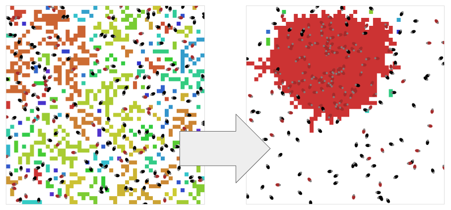
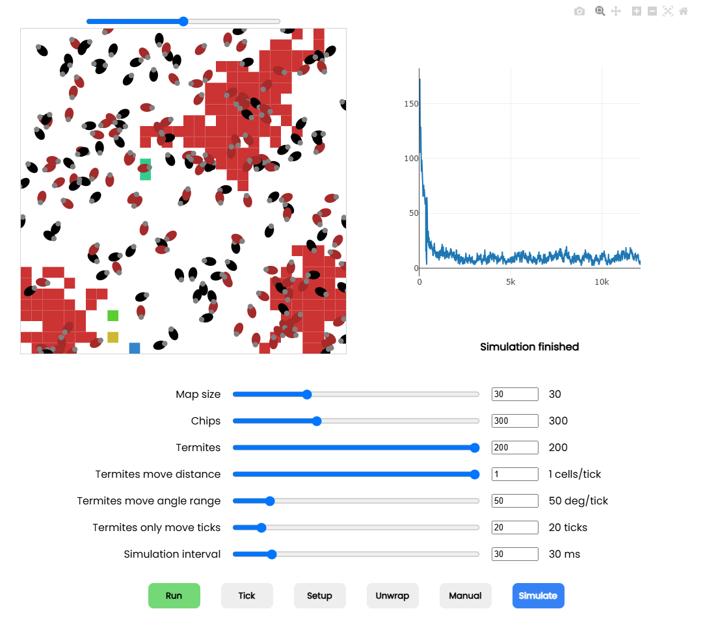

# Termites

Autonomous agents that follow simple rules to create complex behavior.\
The algorithm mimics termites behavior of creating wood chip mounds.\
Based on NetLogo [Termites](https://ccl.northwestern.edu/netlogo/models/Termites) model.

Try it out: [https://termites.surge.com/](https://termites.surge.com/)

